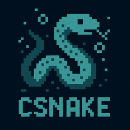

# C++ Snake Game



A classic Snake game implementation in C++ for the console/terminal with smooth gameplay, colorful graphics, and cross-platform support.

## Features

- **Console Graphics**: Uses ANSI escape codes for colors and box-drawing characters
- **Smooth Gameplay**: Frame-rate controlled animation with increasing difficulty
- **Cross-Platform**: (Hopefully) Works on Windows, macOS, and Linux
  - I've only tested on MacOS with iterm2
- **Responsive Controls**: WASD or arrow key support with non-blocking input
- **Progressive Difficulty**: Game speeds up as you score more points
- **Score Tracking**: Keep track of your score and snake length
- **Pause Functionality**: Pause and resume gameplay anytime
- **Collision Detection**: Proper wall and self-collision detection
- **Welcome & Game Over Screens**: Polished UI with ASCII art

## Screenshots

```
╔════════════════════════════════════════════╗
║        C++ SNAKE GAME                      ║
╚════════════════════════════════════════════╝

  Score: 5    Speed: 75

  ┌────────────────────────────────────────┐
  │                                        │
  │         ◆■■■                           │
  │                                        │
  │                    ●                   │
  │                                        │
  │                                        │
  └────────────────────────────────────────┘

  Controls: WASD or Arrow Keys | SPACE to pause | Q to quit
```

## Building and Running

### Prerequisites

- C++11 compatible compiler (g++, clang, MSVC)
- CMake 3.10 or higher (optional, but recommended)

### Option 1: Using CMake (Recommended)

```bash
# Create build directory
mkdir build
cd build

# Configure and build
cmake ..
cmake --build .

# Run the game
./snake        # On macOS/Linux
snake.exe      # On Windows
```

### Option 2: Direct Compilation

#### macOS/Linux:
```bash
g++ -std=c++11 -O3 -o snake snake.cpp
./snake
```

#### Windows (MSVC):
```bash
cl /EHsc /O2 snake.cpp
snake.exe
```

#### Windows (MinGW):
```bash
g++ -std=c++11 -O3 -o snake.exe snake.cpp
snake.exe
```

## How to Play

1. **Start the Game**: Run the executable and press any key at the welcome screen
2. **Control the Snake**:
   - Use `W/↑` to move up
   - Use `S/↓` to move down
   - Use `A/←` to move left
   - Use `D/→` to move right
3. **Objective**: Eat the red food (●) to grow your snake and increase your score
4. **Avoid**:
   - Hitting the walls
   - Running into yourself
5. **Special Controls**:
   - Press `SPACE` to pause/resume
   - Press `Q` to quit
   - Press `R` to restart after game over

## Game Mechanics

- **Starting Length**: The snake starts with 3 segments
- **Growth**: Each food eaten adds one segment to the snake
- **Speed**: The game starts at a comfortable pace and speeds up with each food eaten
- **Scoring**: Each food eaten = 1 point
- **Difficulty**: Speed increases by 5ms per food, capped at maximum difficulty

## Technical Details

### Architecture

The game is built with clean object-oriented design:

- **SnakeGame Class**: Main game logic and state management
- **KeyboardInput Class**: Cross-platform keyboard input handling
- **Point Struct**: 2D coordinate representation
- **Direction Enum**: Movement direction states

### Cross-Platform Input Handling

- **Windows**: Uses `_kbhit()` and `_getch()` from `<conio.h>`
- **Unix/Linux/macOS**: Uses `termios` for non-canonical input and `fcntl` for non-blocking reads

### Rendering

- Uses ANSI escape codes for:
  - Terminal clearing and cursor positioning
  - Text colors (red, green, yellow, cyan, etc.)
  - Bold text
  - Cursor visibility control

## Performance Notes

- The game runs at variable frame rates based on difficulty
- Initial speed: 150ms per frame
- Maximum speed: 50ms per frame (20 FPS)
- Uses `std::deque` for efficient snake body management

## Achievements

The game recognizes different skill levels:
- **Score < 15**: Good try!
- **Score 15-29**: Great job!
- **Score 30-49**: Amazing!
- **Score 50+**: Legendary Snake Master!

## Troubleshooting

### Colors not showing correctly
- Ensure your terminal supports ANSI escape codes
- On Windows, use Windows Terminal or enable ANSI support in Command Prompt

### Input lag or unresponsive controls
- Close other applications that might be using stdin
- Ensure your terminal window has focus

### Compilation errors
- Verify you have a C++11 compatible compiler
- Check that all required headers are available on your system

## Credits

Created as a demonstration of C++ console game programming using AI coding assistants. Thanks, robot friends! 🤖

## License

MIT License. This is a sample educational project. Feel free to use, modify, and distribute as needed.

## Future Enhancement Ideas

- High score persistence (save to file)
- Multiple difficulty levels
- Power-ups and special items
- Obstacles and maze levels
- Two-player mode
- Custom color themes
- Sound effects (if terminal supports beep)
- Wrap-around walls mode

Enjoy the game!
